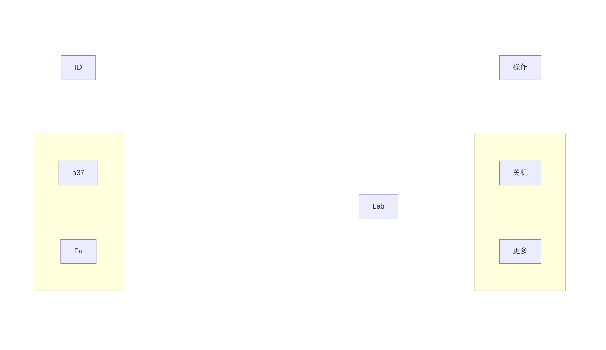

```mermaid
%%{init: {"flowchart": {"nodeSpacing": 90, "rankSpacing": 70}}}%%
flowchart TB

classDef ghost fill:transparent,stroke:transparent,color:transparent;

subgraph GRID[" "]
  direction LR

  subgraph COL1[" "]
    direction TB
    ID["ID"]

    subgraph G1[" "]
      direction TB
      A["a37"]
      B["Fa"]
      A ~~~ B
    end

    ID ~~~ A
  end

  subgraph COL2[" "]
    direction TB
    DOTS1["...................."]
    DOTS2["...................."]
    DOTS1 ~~~ DOTS2
    class DOTS1,DOTS2 ghost
  end

  subgraph COL3[" "]
    direction TB
    SP[" "]
    LAB["Lab"]
    SP ~~~ LAB
    class SP ghost
  end

  subgraph COL4[" "]
    direction TB
    OP["操作"]

    subgraph G2[" "]
      direction LR
      OFF["关机"]
      MORE["更多"]
      OFF ~~~ MORE
    end

    OP ~~~ OFF
  end

  COL1 ~~~ COL2 ~~~ COL3 ~~~ COL4
end

style GRID fill:transparent,stroke:transparent;
style COL1 fill:transparent,stroke:transparent;
style COL2 fill:transparent,stroke:transparent;
style COL3 fill:transparent,stroke:transparent;
style COL4 fill:transparent,stroke:transparent;

```
