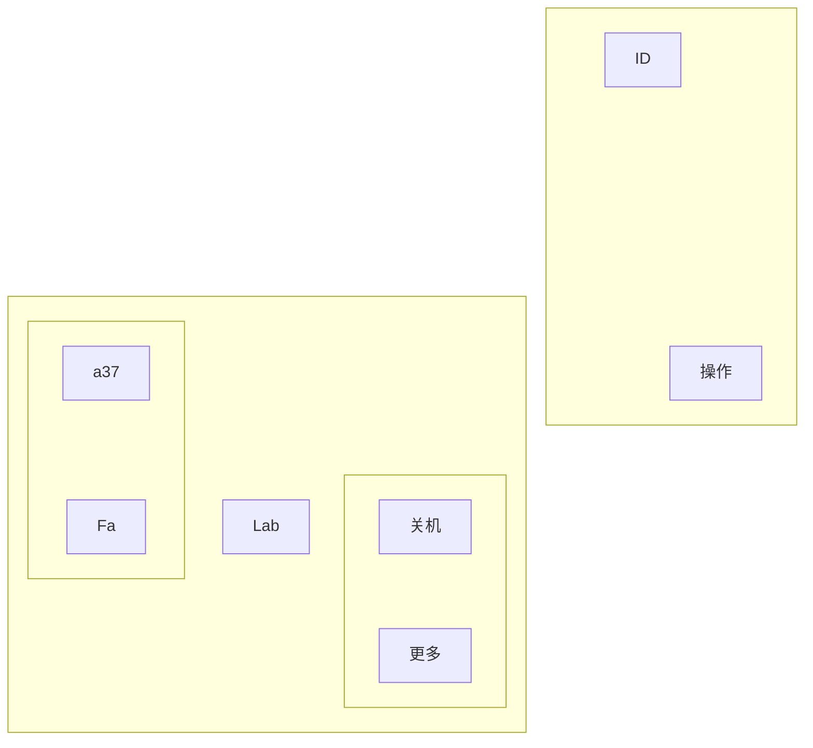

```mermaid
flowchart TB
  subgraph R1[" "]
    direction LR
    ID["ID"] ~~~ S1[" "] ~~~ S2[" "] ~~~ OP["操作"]
  end

  subgraph R2[" "]
    direction LR
    subgraph G1[" "]
      direction TB
      A["a37"] ~~~ B["Fa"]
    end
    S3[" "] ~~~ LAB["Lab"] ~~~ S4[" "]
    subgraph G2[" "]
      direction LR
      OFF["关机"] ~~~ MORE["更多"]
    end
  end

  ID ~~~ A
  S2 ~~~ LAB
  OP ~~~ OFF

  classDef ghost fill:transparent,stroke:transparent,color:transparent;
  class S1,S2,S3,S4 ghost;
```
