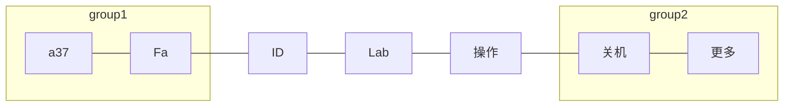

```mermaid
flowchart LR
  subgraph group1["group1"]
    A["a37"]
    B["Fa"]
    A --- B
  end

  ID["ID"] --- LAB["Lab"] --- OP["操作"]

  subgraph group2["group2"]
    OFF["关机"]
    MORE["更多"]
    OFF --- MORE
  end

  B --- ID
  OP --- OFF
```
